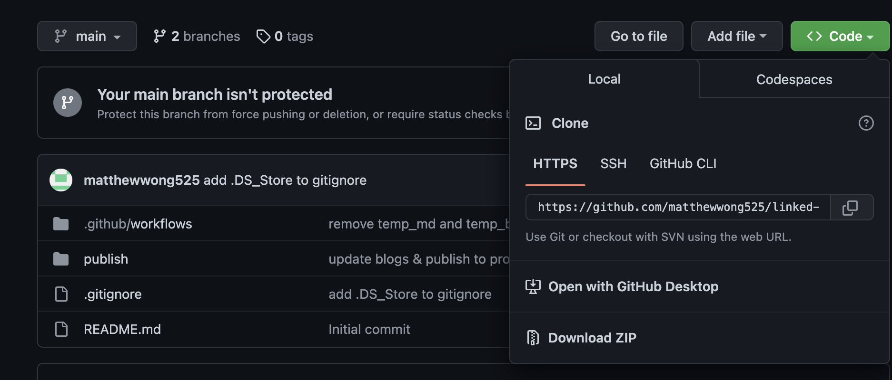

1. Clone the repository or "Download As Zip"
   
1. Unzip the downloaded folder, then open the folder as a vault in Obsidian
1. Install the [Obsidian Git](https://github.com/denolehov/obsidian-git) community plugin
1. To publish your notes run the command "Obsidian Git: Create backup" by opening the command palette (CMD/Ctrl + P)

This is another MD note or is it? [External note](https://raw.githubusercontent.com/DanielZ1337/VOP-exercises/main/README.md)

- $x + y$
